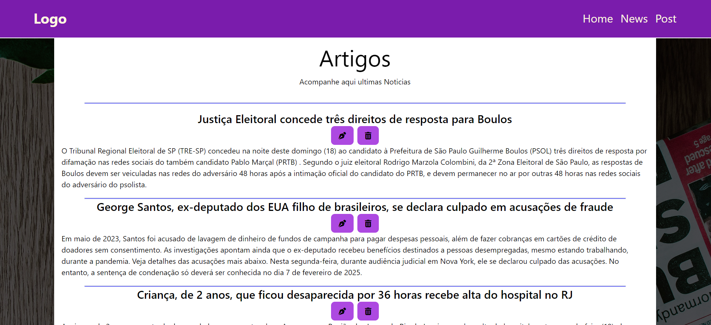

#### Simple Fullstack Project

Using React.Vite + Tailwind + Mysql

### API

I use mysql,express,nodemon and cors

### client

I use react-router-dom and axios

the proposal for this projetc is ust write,delete,edit articles.

